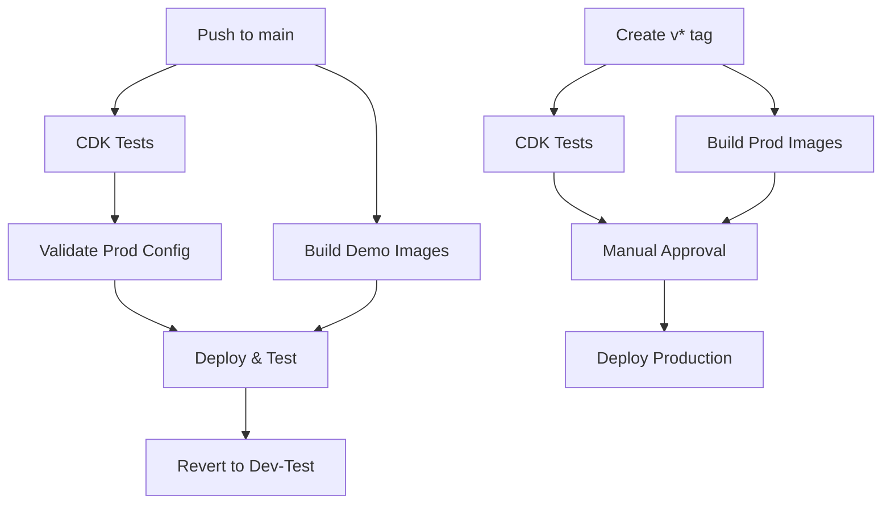

# AWS GitHub Actions Setup for TakInfra

This guide covers setting up GitHub Actions for the TakInfra repository, building on the base infrastructure already configured in BaseInfra.

## Prerequisites

**⚠️ Important:** Steps 1-2 from the [BaseInfra AWS GitHub Setup](https://github.com/TAK-NZ/base-infra/blob/main/docs/AWS_GITHUB_SETUP.md) must be completed first:
- Route 53 DNS setup
- GitHub OIDC Identity Provider and IAM roles

## 3. GitHub Environment Setup for TakInfra

### 3.1 Create Environments

In your TakInfra GitHub repository, go to **Settings → Environments** and create:

1. **`production`** environment
   - **Protection rules:**
     - Required reviewers: Add team leads
     - Wait timer: 5 minutes
     - Deployment branches and tags: Select "Selected branches and tags"
       - Add rule: "v*" (for version tags like v1.0.0)

2. **`demo`** environment
   - **Protection rules:**
     - Deployment branches and tags: Select "Selected branches and tags"
       - Add rule: "main"
   - **Environment variables:**
     - `DEMO_TEST_DURATION`: `300` (wait time in seconds, default 5 minutes)
     - `STACK_NAME`: `Demo`

### 3.2 Configure Environment Secrets

**For `production` environment:**
- `AWS_ACCOUNT_ID`: `111111111111`
- `AWS_ROLE_ARN`: `arn:aws:iam::111111111111:role/GitHubActions-TAK-Role`
- `AWS_REGION`: `ap-southeast-6`

**For `demo` environment:**
- `AWS_ACCOUNT_ID`: `222222222222`
- `AWS_ROLE_ARN`: `arn:aws:iam::222222222222:role/GitHubActions-TAK-Role`
- `AWS_REGION`: `ap-southeast-2`

## 4. Branch Protection Setup

**Configure branch protection for `main`** to ensure only tested code is deployed:

1. Go to **Settings → Branches → Add rule**
2. **Branch name pattern**: `main`
3. **Enable these protections:**
   - ☑️ Require a pull request before merging
   - ☑️ Require status checks to pass before merging
     - ☑️ Require branches to be up to date before merging
     - ☑️ Status checks: Select "Test CDK code" after first workflow run

## 5. Breaking Change Detection for TakInfra

### 5.1 TakInfra-Specific Breaking Changes

**Critical resources that trigger breaking change detection:**
- PostgreSQL database cluster replacements
- EFS file system replacements
- Network Load Balancer replacements
- Secrets Manager secret deletions
- TAK server configuration changes

### 5.2 Override Mechanism

To deploy breaking changes intentionally:

1. **Include `[force-deploy]` in commit message**:
```bash
git commit -m "feat: upgrade PostgreSQL engine version [force-deploy]"
```

2. **The workflows will detect the override and proceed with deployment**

## 6. GitHub Actions Workflows

### 6.1 Workflow Architecture



### 6.2 Demo Testing Workflow (`demo-deploy.yml`)

**Triggers:**
- Push to `main` branch
- Manual dispatch

**Jobs:**
1. **test**: Run CDK unit tests and linting
2. **build-images**: Build TAK server Docker images for demo environment
3. **validate-prod**: Validate production configuration (runs in parallel)
4. **deploy-and-test**: Deploy with prod profile and run tests
5. **revert-to-dev-test**: Always revert to dev-test configuration

**Flow:**
```
Push → [Tests + Build Images + Validate Prod] → Deploy & Test → Revert
```

### 6.3 Production Deployment Workflow (`production-deploy.yml`)

**Triggers:**
- Version tags (`v*`)
- Manual dispatch

**Jobs:**
1. **test**: Run CDK unit tests
2. **build-images**: Build TAK server Docker images for production
3. **deploy-production**: Deploy to production with built images (requires approval)

**Flow:**
```
Tag v* → [Tests + Build Images] → Deploy Production
```

### 6.4 Build Workflows

**Demo Build (`demo-build.yml`):**
- Triggers on push to main (docker/ or cdk.json changes)
- Uses `dev-test` context from cdk.json
- Builds TAK server image with tak-nz branding
- Pushes to demo ECR repository

**Production Build (`production-build.yml`):**
- Triggers only on version tags (`v*`)
- Uses `prod` context from cdk.json
- Builds TAK server image with production configuration
- Pushes to production ECR repository

### 6.5 Required Secrets and Variables

**Environment Secrets (per environment):**

| Secret | Description | Example |
|--------|-------------|----------|
| `AWS_ACCOUNT_ID` | AWS account ID | `123456789012` |
| `AWS_ROLE_ARN` | GitHub Actions IAM role ARN | `arn:aws:iam::123456789012:role/GitHubActions-TAK-Role` |
| `AWS_REGION` | AWS deployment region | `ap-southeast-2` |

**Environment Variables:**

| Variable | Environment | Description | Example | Required |
|----------|-------------|-------------|---------|----------|
| `STACK_NAME` | demo, prod | Stack name suffix | `Demo`, `Prod` | ✅ |
| `DEMO_TEST_DURATION` | demo | Test wait time in seconds | `300` | ❌ |

## 7. Composite Actions

### 7.1 Setup CDK Environment Action

Location: `.github/actions/setup-cdk/action.yml`

**Purpose:** Reduces code duplication by consolidating common setup steps:
- Repository checkout
- Node.js setup with npm caching
- AWS credentials configuration
- Dependency installation

**Usage:**
```yaml
- name: Setup CDK Environment
  uses: ./.github/actions/setup-cdk
  with:
    aws-role-arn: ${{ secrets.AWS_ROLE_ARN }}
    aws-region: ${{ secrets.AWS_REGION }}
    role-session-name: GitHubActions-Demo
```

## 8. Verification

Test the TakInfra setup:

1. **Demo Testing:** Push to `main` branch → Should deploy demo with prod profile → Wait → Run tests → Revert to dev-test profile
2. **Production:** Create and push version tag:
   ```bash
   git tag v1.0.0
   git push origin v1.0.0
   ```
   → Should require approval → Deploy after approval

### 8.1 Deployment Flow

**Main Branch Push:**
```
Push to main → Tests → Demo (prod profile) → Wait → Tests → Demo (dev-test profile)
```

**Version Tag Push:**
```
Tag v* → Tests → Production (prod profile) [requires approval]
```

## 9. Troubleshooting

### 9.1 Common Workflow Issues

**Workflow Failures:**

| Issue | Symptoms | Solution |
|-------|----------|----------|
| **Missing Secrets** | `Error: Could not assume role` | Verify environment secrets are set correctly |
| **Missing Variables** | `Error: Required variable not set` | Ensure `STACK_NAME` is configured |
| **Breaking Changes** | Workflow stops at validation | Use `[force-deploy]` in commit message or fix changes |
| **Image Build Fails** | Docker build errors | Check Dockerfile and TAK server version |
| **CDK Synthesis Fails** | `cdk synth` command fails | Verify cdk.json context values |
| **TAK Server Download** | S3 download errors | Verify BaseInfra S3 bucket exists and contains TAK server zip |

### 9.2 TAK Server Specific Issues

**Common TAK Server Problems:**

- **Version Mismatch:** Ensure TAK server version in cdk.json matches available zip file
- **Branding Issues:** Verify branding files exist in docker-container/branding/
- **Configuration Errors:** Check TAK server configuration in docker-container/scripts/
- **Certificate Issues:** Verify Let's Encrypt configuration for production

**Debug Commands:**

```bash
# Check TAK server version
jq -r '.context."dev-test".takserver.version' cdk.json

# Verify S3 bucket contents
aws s3 ls s3://$(aws cloudformation describe-stacks --stack-name TAK-Demo-BaseInfra --query 'Stacks[0].Outputs[?OutputKey==`S3TAKImagesArn`].OutputValue' --output text | sed 's|arn:aws:s3:::|s3://|')/

# Test TAK server image
docker run --rm -it <ecr-repo-uri>:<tag> /bin/bash
```

### 9.3 Dependencies on BaseInfra and AuthInfra

**Required BaseInfra Resources:**
- VPC and networking (subnets, security groups)
- ECS cluster and service discovery
- KMS keys for encryption
- Route 53 hosted zones
- S3 buckets for CDK assets and TAK server images
- ECR repositories

**Required AuthInfra Resources:**
- PostgreSQL database cluster
- Redis cluster (for session management)
- Application Load Balancer (for OIDC integration)
- Secrets Manager secrets (for database credentials)

**Verification Commands:**
```bash
# Check BaseInfra stack
aws cloudformation describe-stacks --stack-name TAK-Demo-BaseInfra

# Check AuthInfra stack
aws cloudformation describe-stacks --stack-name TAK-Demo-AuthInfra

# Verify database connectivity
aws rds describe-db-clusters --db-cluster-identifier tak-demo-postgres
```

Ensure both BaseInfra and AuthInfra are deployed and stable before deploying TakInfra changes.